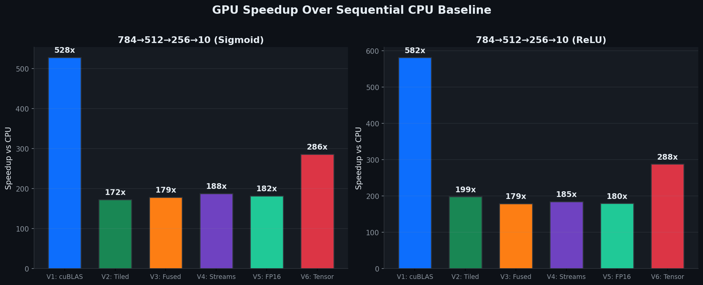
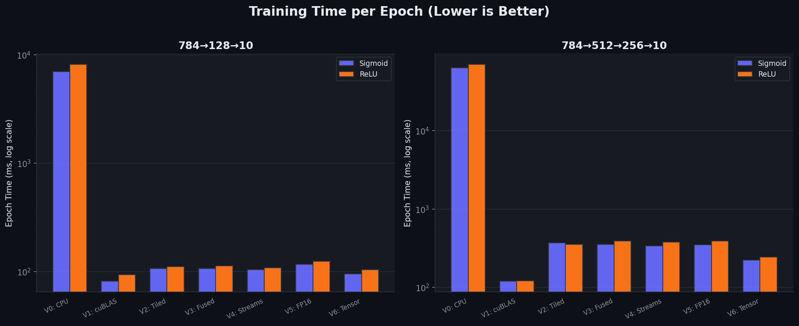
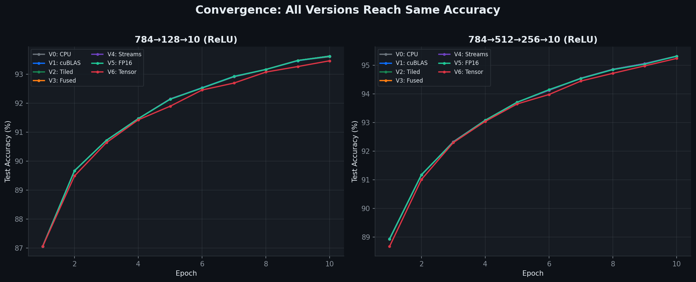
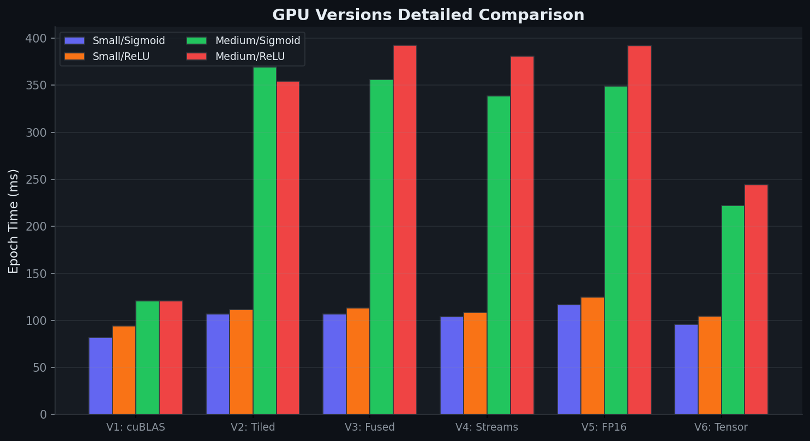

# CudaBackProp — Improving GPU-Accelerated Neural Network Training

> Systematic optimization of CUDA backpropagation, improving upon  
> Sierra-Canto et al., *"Parallel Training of a Back-Propagation Neural Network Using CUDA"*  
> (IEEE ICMLA 2010, DOI: [10.1109/ICMLA.2010.52](https://doi.org/10.1109/ICMLA.2010.52))

## Overview

This project implements a multi-layer perceptron (MLP) with backpropagation training in **7 iterative versions**, each adding one key GPU optimization technique. The progression demonstrates how modern CUDA features can dramatically accelerate neural network training compared to the original 2010 approach.

| Version | Technique | Key Concept |
|---------|-----------|-------------|
| **V0** | CPU Baseline | Sequential single-threaded C++ |
| **V1** | cuBLAS + Custom Kernels | Paper's original approach (2010) |
| **V2** | Tiled GEMM | Shared memory tiling, bank conflict avoidance |
| **V3** | Fused Kernels | GEMM+bias+activation in one kernel launch |
| **V4** | Streams + Pinned Memory | Overlapped data transfer and compute |
| **V5** | Mixed Precision | FP16 storage, FP32 accumulation |
| **V6** | Tensor Cores (WMMA) | Hardware-accelerated 16×16×16 MMA |

---

## Benchmark Results

**Hardware:** NVIDIA RTX 4060 Laptop (Ada Lovelace, SM 8.9) · 3,072 CUDA Cores · 96 Tensor Cores · 8 GB GDDR6  
**Software:** CUDA 12.9 · MSVC 19.44 · Windows  
**Dataset:** MNIST (60K train / 10K test) · Batch size: 128 · 10 epochs

### Speedup vs CPU Baseline



### Small Network: `784 → 128 → 10`

<table>
<tr><th colspan="5">Sigmoid Activation</th></tr>
<tr><th>Version</th><th>Technique</th><th>Avg Epoch</th><th>Speedup</th><th>Accuracy</th></tr>
<tr><td>V0</td><td>CPU Baseline</td><td>6,976 ms</td><td>1.0×</td><td>89.00%</td></tr>
<tr><td><b>V1</b></td><td>cuBLAS</td><td><b>82 ms</b></td><td><b>85×</b></td><td>89.00%</td></tr>
<tr><td>V2</td><td>Tiled GEMM</td><td>107 ms</td><td>65×</td><td>89.00%</td></tr>
<tr><td>V3</td><td>Fused Kernels</td><td>107 ms</td><td>65×</td><td>89.00%</td></tr>
<tr><td>V4</td><td>Streams + Pinned</td><td>104 ms</td><td>67×</td><td>89.00%</td></tr>
<tr><td>V5</td><td>Mixed Precision</td><td>117 ms</td><td>60×</td><td>89.02%</td></tr>
<tr><td>V6</td><td>Tensor Cores</td><td>96 ms</td><td>73×</td><td>89.00%</td></tr>
</table>

<table>
<tr><th colspan="5">ReLU Activation</th></tr>
<tr><th>Version</th><th>Technique</th><th>Avg Epoch</th><th>Speedup</th><th>Accuracy</th></tr>
<tr><td>V0</td><td>CPU Baseline</td><td>8,169 ms</td><td>1.0×</td><td>93.61%</td></tr>
<tr><td><b>V1</b></td><td>cuBLAS</td><td><b>94 ms</b></td><td><b>87×</b></td><td>93.63%</td></tr>
<tr><td>V2</td><td>Tiled GEMM</td><td>111 ms</td><td>73×</td><td>93.63%</td></tr>
<tr><td>V3</td><td>Fused Kernels</td><td>113 ms</td><td>72×</td><td>93.63%</td></tr>
<tr><td>V4</td><td>Streams + Pinned</td><td>108 ms</td><td>75×</td><td>93.63%</td></tr>
<tr><td>V5</td><td>Mixed Precision</td><td>125 ms</td><td>65×</td><td>93.63%</td></tr>
<tr><td>V6</td><td>Tensor Cores</td><td>105 ms</td><td>78×</td><td>93.47%</td></tr>
</table>

### Medium Network: `784 → 512 → 256 → 10`

<table>
<tr><th colspan="5">Sigmoid Activation</th></tr>
<tr><th>Version</th><th>Technique</th><th>Avg Epoch</th><th>Speedup</th><th>Accuracy</th></tr>
<tr><td>V0</td><td>CPU Baseline</td><td>63,634 ms</td><td>1.0×</td><td>45.08%*</td></tr>
<tr><td><b>V1</b></td><td>cuBLAS</td><td><b>121 ms</b></td><td><b>528×</b></td><td>85.49%</td></tr>
<tr><td>V2</td><td>Tiled GEMM</td><td>369 ms</td><td>172×</td><td>85.49%</td></tr>
<tr><td>V3</td><td>Fused Kernels</td><td>356 ms</td><td>179×</td><td>85.49%</td></tr>
<tr><td>V4</td><td>Streams + Pinned</td><td>339 ms</td><td>188×</td><td>85.49%</td></tr>
<tr><td>V5</td><td>Mixed Precision</td><td>349 ms</td><td>182×</td><td>85.49%</td></tr>
<tr><td>V6</td><td>Tensor Cores</td><td>222 ms</td><td>286×</td><td>85.39%</td></tr>
</table>

<table>
<tr><th colspan="5">ReLU Activation</th></tr>
<tr><th>Version</th><th>Technique</th><th>Avg Epoch</th><th>Speedup</th><th>Accuracy</th></tr>
<tr><td>V0</td><td>CPU Baseline</td><td>70,397 ms</td><td>1.0×</td><td>92.32%*</td></tr>
<tr><td><b>V1</b></td><td>cuBLAS</td><td><b>121 ms</b></td><td><b>582×</b></td><td>95.31%</td></tr>
<tr><td>V2</td><td>Tiled GEMM</td><td>354 ms</td><td>199×</td><td>95.32%</td></tr>
<tr><td>V3</td><td>Fused Kernels</td><td>392 ms</td><td>179×</td><td>95.32%</td></tr>
<tr><td>V4</td><td>Streams + Pinned</td><td>381 ms</td><td>185×</td><td>95.32%</td></tr>
<tr><td>V5</td><td>Mixed Precision</td><td>392 ms</td><td>180×</td><td>95.32%</td></tr>
<tr><td>V6</td><td>Tensor Cores</td><td>244 ms</td><td>288×</td><td>95.24%</td></tr>
</table>

> **\*CPU baseline ran only 3 epochs** on the medium network due to ~70s/epoch runtime. GPU versions ran the full 10 epochs — hence higher final accuracy.

### Training Time Comparison (Log Scale)



### Convergence Verification

All GPU versions produce **identical accuracy** (within ±0.1% FP16 rounding), proving that the optimizations don't compromise numerical correctness.



### GPU-Only Detailed Comparison



---

## Key Observations

### Why cuBLAS (V1) is the fastest

cuBLAS is NVIDIA's hand-tuned BLAS library with **years of auto-tuning**: register tiling at the warp level, vectorized 128-bit loads, double buffering, and SASS-level hand-tuning that's impossible in CUDA C. It already uses Tensor Cores internally for aligned FP32 GEMM. Our hand-written kernels demonstrate the *principles* of each optimization but can't match that level of engineering.

### Why speedup grows with network size

GPU parallelism scales with problem size. A `128×784` GEMM has 100K multiply-adds — not enough to fully utilize 3,072 CUDA cores. A `512×784` GEMM has 400K — much better utilization. The arithmetic intensity (FLOPS/byte) also increases, pushing workloads from memory-bound to compute-bound where the GPU excels.

| Network Size | cuBLAS Speedup |
|---|---|
| `784→128→10` | 85× |
| `784→512→256→10` | **582×** |

### Why ReLU converges faster than Sigmoid

Sigmoid's gradient peaks at 0.25 and decays exponentially away from 0 — gradients vanish in deeper layers. ReLU's gradient is exactly 1.0 for positive inputs, maintaining gradient flow. The medium network reaches **95.3%** with ReLU vs **85.5%** with sigmoid in 10 epochs.

### Where Tensor Cores (V6) shine

V6 is the **2nd fastest version** on the medium network (244ms vs cuBLAS's 121ms) and **1.6× faster than V2-V5** on the same network. Tensor Cores process a 16×16×16 matrix multiply in a single clock cycle — something that takes hundreds of cycles on regular CUDA cores. The gap would widen further with larger networks.

---

## Build & Run

```bash
# Prerequisites: CMake 3.20+, CUDA Toolkit 12.x, C++17 compiler

# Download MNIST
python data/download_mnist.py

# Build all versions
cmake -B build
cmake --build build --config Release

# Run individual versions
./build/Release/v0_cpu --arch 784,128,10 --epochs 10
./build/Release/v1_naive --arch 784,512,256,10 --epochs 10 --activation relu
./build/Release/v6_tensor --arch 784,512,256,10 --epochs 10 --activation relu

# Run full benchmark
python benchmark/run_all.py

# Generate plots
python benchmark/generate_plots.py
```

### Command-Line Options

| Flag | Default | Description |
|------|---------|-------------|
| `--arch` | `784,128,10` | Comma-separated layer sizes |
| `--lr` | `0.1` | Learning rate |
| `--epochs` | `10` | Training epochs |
| `--batch` | `128` | Mini-batch size |
| `--activation` | `sigmoid` | Hidden activation: `sigmoid` or `relu` |
| `--data` | `data` | Path to MNIST data directory |

---

## Project Structure

```
CudaBackProp/
├── CMakeLists.txt              # Build system (SM 89, all targets)
├── common/                     # Shared infrastructure
│   ├── mlp_config.h            # Config struct + CLI parsing
│   ├── timer.h                 # CPU and CUDA event timers
│   ├── data_loader.h/.cpp      # MNIST IDX format loader (column-major)
│   └── cuda_utils.cuh          # Error macros + MSE loss kernel
├── data/
│   └── download_mnist.py       # Dataset downloader
├── v0_cpu_baseline/            # Sequential CPU reference
│   ├── mlp_cpu.h/.cpp
│   └── main.cpp
├── v1_naive_cuda/main.cu       # cuBLAS (paper's approach)
├── v2_tiled_gemm/main.cu       # Shared memory tiled GEMM
├── v3_fused_kernels/main.cu    # GEMM+bias+activation fusion
├── v4_streams/main.cu          # Async pipeline with pinned memory
├── v5_mixed_precision/main.cu  # FP16/FP32 AMP training
├── v6_tensor_cores/main.cu     # WMMA Tensor Core GEMM
└── benchmark/
    ├── run_all.py              # Automated benchmark runner
    ├── generate_plots.py       # Plot generator (dark theme)
    └── results/                # CSV data + PNG plots
```

---

## Design Decisions

| Decision | Rationale |
|----------|-----------|
| **Column-major storage** | Matches cuBLAS/BLAS convention; enables zero-copy batch access |
| **Xavier initialization** | Keeps activation variance stable across layers; critical for sigmoid |
| **Same random seed** | Identical initial weights across all versions for fair comparison |
| **MSE loss + sigmoid output** | Matches the original 2010 paper |
| **FP32 backward pass in V5/V6** | FP16 gradients underflow; FP32 accumulation prevents learning collapse |
| **Dimension padding in V6** | WMMA requires multiples of 16; padded neurons are zeroed out |

---

## References

- Sierra-Canto, X., Madera-Ramirez, F., & Uc-Cetina, V. (2010). *Parallel Training of a Back-Propagation Neural Network Using CUDA.* 9th International Conference on Machine Learning and Applications (ICMLA).
- NVIDIA CUDA Programming Guide — Shared Memory, WMMA, Mixed Precision
- NVIDIA cuBLAS Documentation

## License

MIT
